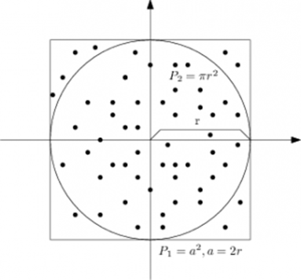

# Modelowanie komputerowe za pomocą metody Monte Carlo

Na tej lekcji omówimy probabilistyczną metodę modelowania rzeczywistości - Metodę Monte Carlo. Używa się jej w celu zamodelowania procesów na tyle złożonych, że ich wyniku nie można łatwo przewidzieć za pomocą podejścia analitycznego (dokonania wyliczeń na podstawie wzoru). Istotną rolę w danej metodzie odgrywa losowanie pewnych wartości, które charakteryzują analizowany proces. Modułem wbudowanym służącym do generowania liczb pseudolosowych w Pythonie jest moduł ```random```. Zanim jednak przejdziemy do omówienia metody Monte Carlo czy modułu ```random```, skupimy się na zagadnieniu związanym z losowaniem liczb zespolonych.

## Liczby zespolone

Język Python zapewnia obsługę liczb zespolonych za pomocą funkcji wbudowanych, a dla bardziej zaawansowanych funkcji w module ```cmath```.

Istnieją dwa sposoby tworzenia liczby zespolonej: możesz przypisać liczbę rzeczywistą + urojoną * ```1j``` do zmiennej lub wywołać funkcję ```complex``` z dwoma argumentami - częścią rzeczywistą i urojoną (liczby zmiennoprzecinkowe). W przypadku tego ostatniego nie musisz używać ```j```.

```python
# I sposób
a = 4 + 3j
print(a)  # (4+3j)
print(type(a))  # <class 'complex'>

# II sposób
a = complex(4, 3)
print(a)  # (4+3j)
print(type(a))  # <class 'complex'>
```

Wracając do podstaw - liczba zespolona zapisana w postaci algebraicznej ```z = a+bi``` może być określona za pomocą współrzędnych ```(a,b)``` na płaszczyźnie zespolonej. Tutaj zmienna ```a``` stanowi część rzeczywistą, a zmienna ```b``` cześć urojoną. Możemy się do nich dobrać stosując odpowiednie metody: ```real``` oraz ```imag```. Moduł liczby zespolonej definiujemy jako , a argumentem kąt jaki tworzy wektor ```z``` z prostą ```Re```. Sprzęrzenie jest to operacja, która zmienia znak przy części urojonej liczby zespolonej na przeciwny - w Pythonie mamy do tego metodę ```conjugate()```.


```python
a = 4+3j
print(a.real)  # 4.0
print(a.imag)  # 3.0

a.conjugate()  # (4-3j)
```

Chcąc wyznaczyć argument liczby zespolonej będziemy musieli już zaimportować moduł ```cmath```, który właśnie dostarcza funkcje do dalszych obliczeń na liczbach zespolonych. Zauważ, że argument liczby możemy także wyrazić jako ```atan(Im(z)/Re(z))```, co możemy łatwo sprawdzić w kodzie.

```python
import cmath
import math
 
num = 4 + 3j
 
# Moduł cmath do wyznaczenia argumentu
p = cmath.phase(num)
print('cmath:', p)  # cmath Module: 0.6435011087932844
 
# Moduł math do wyliczenia funkcji trygonometrycznej
p = math.atan(num.imag/num.real)
print('math:', p)  # math Module: 0.6435011087932844
```

Zachęcam do poszukania więcej na temat modułu ```cmath``` w [Dokumentacji](https://docs.python.org/3/library/cmath.html?highlight=cmath). Wracając do podstawowych operacji na liczbach zespolonych - bez dodatkowych bibliotek możemy wykonac operacje dodawania, odejmowania, mnożenia i dzielenia.

```python
a = 1 + 2j
b = 2 + 4j
print('Dodawanie:', a + b)    # (3+6j)
print('Odejmowanie:', a - b)  # (-1-2j)
print('Mnożenie:', a * b)     # (-6+8j)
print('Dzielenie:', a / b)    # (2+0j)
```

UWAGA: W przeciwieństwie do liczb zmiennoprzecinkowych nie możemy porównać dwóch liczb zespolonych. Możemy tylko indywidualnie porównać ich części rzeczywiste i urojone, ponieważ są to liczby rzeczywiste.

```python
a = 4 + 3j
b = 4 + 6j
print(a < b)

# typ błędu
Traceback (most recent call last):
  File "<stdin>", line 1, in <module>
TypeError: '<' not supported between instances of 'complex' and 'complex'
```

## Generowanie liczb pseudolosowych

Moduł ```random``` implementuje generatory liczb pseudolosowych o różnych rozkładach. Umożliwia wybór losowej liczby całkowitej z zadanego zakresu jak również losowego elementu z podanej sekwencji przy założeniu równomiernego rozkładu prawdopodobieństwa. Implementuje również funkcję generującą losową permutację listy, działającą w miejscu (na tej samej liście, bez tworzenia nowego obiektu), oraz funkcję wybierającą losowe elementy listy bez powtórzeń.

Oferowane są funkcje do obliczania rozkładów: jednorodnego, normalnego (Gaussowskiego), wykładniczego, gamma, czy też beta. W ogólności większość bazuje na funkcji ```random()```, która generuje liczbę zmiennoprzecinkową z przedziału ```[0, 1)``` używając algorytmu [Marsenne Twister](https://pl.wikipedia.org/wiki/Mersenne_Twister).

Inną bardzo pomocną funkcją przy stosowaniu liczb losowych jest ```seed()``` przyjmująca jako argument liczbę całkowitą (w Pythonie 2 była ona przyjmowana jako łańcuch znaków i konwertowana na `int`'a). Ta funkcja pozwoli nam powtórzyć eksperyment z dokładnie takimi samymi liczbami losowymi, co jest bardzo przydatne do sprawdzania wyników symulacji. Uwaga - jeśli będziesz korzystać z paczki ```numpy.random``` pamiętaj aby do ustalenia seeda wykorzystać dunkcję ```numpy.random.seed()```.

Więcej na temat modułu ```random``` znajdziesz w [Dokumentacji](https://docs.python.org/3/library/random.html).

## Metoda Monte Carlo

Istotną rolę w metodzie Monte Carlo odgrywa losowanie (wybór przypadkowy) wielkości charakteryzujących proces, przy czym losowanie dokonywane jest zgodnie z rozkładem, który musi być znany. Najprostszym przykładem pozwalającym zrozumieć daną metodę jest wyznaczanie przybliżonej wartości liczby π. Poniższy rysunek przedstawia daną ideę.



Widoczny jest na nim okrąg o promieniu r = 1. Okrąg został wpisany w kwadrat, a więc pole tego kwadratu wyniesie P<sub>1</sub> = (2r)<sup>2</sup>. Idea metody Monte Carlo przybliżająca wartość liczby π, sprowadza się do tego, iż będziemy losować dwie liczby, będą one stanowić współrzędne punktu tj. wartość x oraz y. Dla każdego wylosowanego punktu musimy sprawdzić, czy mieści się on we wnętrzu koła, tj.: x<sup>2</sup> + y<sup>2</sup> < 1. Wtedy możemy wyliczyć ile punktów wpadło do wnętrza koła (k), w stosunku do wszystkich losowań (n)  →  <sup>P<sub>2</sub></sup>/<sub>P<sub>1</sub></sub> = <sup>k</sup>/<sub>n</sub>. Liczbę π można natomiast wyliczyć stosując wzór π = <sup>4P<sub>2</sub></sup>/<sub>P<sub>1</sub></sub>. Im więcej losowań wykonamy tym nasz ostateczny wynik będzie dokładniejszy. Pamiętaj jednak, że komputery nie generują liczb losowych, tylko tak zwane **liczby pseudolosowe**. Komputerowy generator ma skończony okres, po którym wrócimy do punktu wyjścia i generowane liczby zaczną się powtarzać.

W podobny sposób możemy rozważać błędzenie losowe (teria ruchów Browna została stworzona przez polskiego fizyka Mariana Smoluchowskiego) na prostej (losowy ruch lewo prawo), płaszczyźnie (na przykład orgraniczając się do ruchu lewo-prawo, góra-dół) czy przestrzeni trjówymiarowej. Załóżmy, że zajmiemy się drugim zagadnieniem, w którym w każdym kolejnym kroku mamy do wyboru cztery równoprawodpodobne ruchy. Błądzenie przypadkowe w przestrzeni (gdzie tych kierunków może być 6 w najprostrzym przypadku) stanowi matematyczny model dyfuzji i ruchów Browna - rozprzestrzenienia się cząsteczek substancji w jakimś środowisku. Znaleziona przez nas proporcjonalność prawdopodobieństwa do odwrotności pierwiastka z n jest charakterystyczna dla procesów dyfuzji. Wnioskować stąd można, że średnia odległość od punktu startowego rośnie z czasem t jak pierwiastek z t, a nie proporcjonalnie do pierwszej potęgi t, jak to ma miejsce przy zorganizowanym ruchu swobodnym. Pamiętaj, że charakterystyczne cechy da się dopiero zaobserwować po uśrednieniu - pojedyńcze utuchomienie symulacji nie pozwoli wysnuć odpowiednich wniosków.
