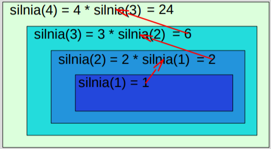

# Algorytmy sortujące w pythonie - ciąg dalszy

Na tej lekcji zajmiemy się trochę bardziej skomplikowanymi, ale i wydajniejszymi czasowo (przynajmniej dla dwóch pierwszych metod) algorytmami sortującymi.
Jednak najpierw zapoznamy się z podstawowym pojęciem w programowaniu - rekursją, znaną także pod nazwą rekurencja.

## Koncepcja rekurencji

Rekurencja jest jednym ze sposóbów rozwiązania problemu, zakładając, że możemy go rozbić na coraz to mniejsze części, aż dojdziemy do takiego punktu, 
w którym problem będzie tak niewielki, iz będzie go można rozwiązać z łatwością.

Sprowadza to nas do napisania funkcji (rekurencyjnej), która będzie wywoływać samą siebie. W ogólności zakładamy, że:

- znamy problem bazowy i jego proste rozwiązanie,
- jesteśmy w stanie rozbić główne zadanie na mniejsze, dochodząc do problemu bazowego,
- wywołujemy w ciele funkcji ją samą.

Najbardziej modelowym zadaniem jest obliczanie silni.



```python
# definicja funkcji iteracyjnej
def silnia_iteracyjnie(x) :
    silnia = 1
    for i in range(1, x+1):
        silnia *= i
    return silnia

# definicja funkcji rekurencyjnej
def silnia_rekurencyjnie(x) :
    if x < 1 :
        return 1
    else :
        return x * silnia_rekurencyjnie(x - 1)

print(silnia_iteracyjnie(5))
print(silnia_rekurencyjnie(5))
```

Rodzajem rekurencji, w której ostatnia operacja wykonywana przez funkcję to rekurencyjne wywołanie samej siebie lub zwrócenie wyniku nazywane 
jest rekurencją ogonową.


```python
def silnia_ogonowa(n, accumulator=1):
  if n == 0: return accumulator
  else: return silnia_ogonowa(n-1, accumulator * n)
```

## Sortowanie przez scalanie

Rekurencyjny algorytm sortowania danych wymagający zarezerwowania dodatkowego miejsca w pamięci. Polega na sekwencyjnym dzieleniu tablicy na 
dwie części aż do dojścia do części niepodzielnej (jednego elementu). Następnie następuje sortowanie przez scalenie (złożenie) każdej 
z tych cześci odzielnie i połączeniu posortowanych podciągłów w jedną posortowana tablicę.

Aby zwizualizować sobie tę metodę zajrzyj do filmu: [LINK](https://www.youtube.com/watch?v=XaqR3G_NVoo&ab_channel=AlgoRythmics).

## Sortowanie szybkie

Szybki i prosty w implementacji algorytm sortowania, najczęściej stosowany. Polega na wyborze jednego elementu rozdzialejącego (*pivota*), 
na podstawie, którego tablica jest dzielona na dwie cześci: do pierwszej przenoszone są wszystkie elementy nie większe od pivota, 
a do drugiego wszystkie elementy większe. Potem sortuje się osobno początkową i końcową część tablicy. Rekursja kończy się, 
gdy kolejny fragment uzyskany z podziału zawiera pojedynczy element, jako że jednoelementowa tablica nie wymaga sortowania.

Aby zwizualizować sobie tę metodę zajrzyj do filmu: [LINK](https://www.youtube.com/watch?v=ywWBy6J5gz8&ab_channel=AlgoRythmics).

## Bogosort - (nie)ciekawe podejście do sortowania

Trywialny w działaniu algorytm sortowania o bardzo dużej złożoności obliczeniowej, oparty na metodzie prób i błędów. Jego idea jest prosta 
- losujemy ustawienie elementów tablicy tak długo aż nie zostaną posortowane. Nie jest używany w praktyce – posortowanie kilkunastu elementów 
może trwać bardzo długo i nie ma pewności, czy w ogóle się zakończy.
